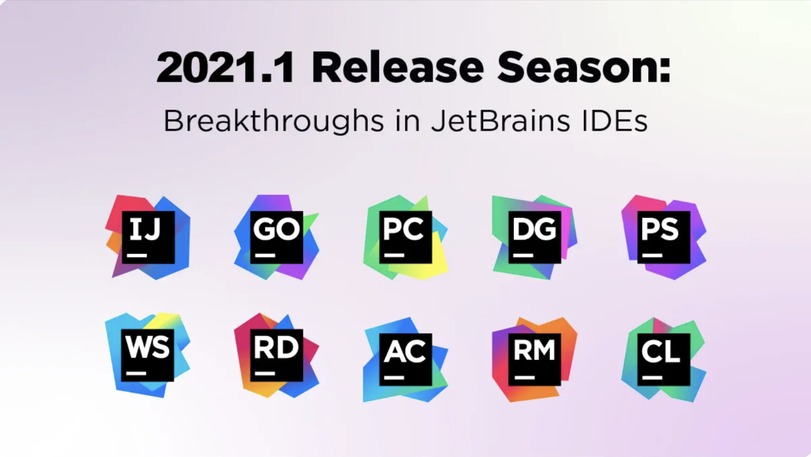
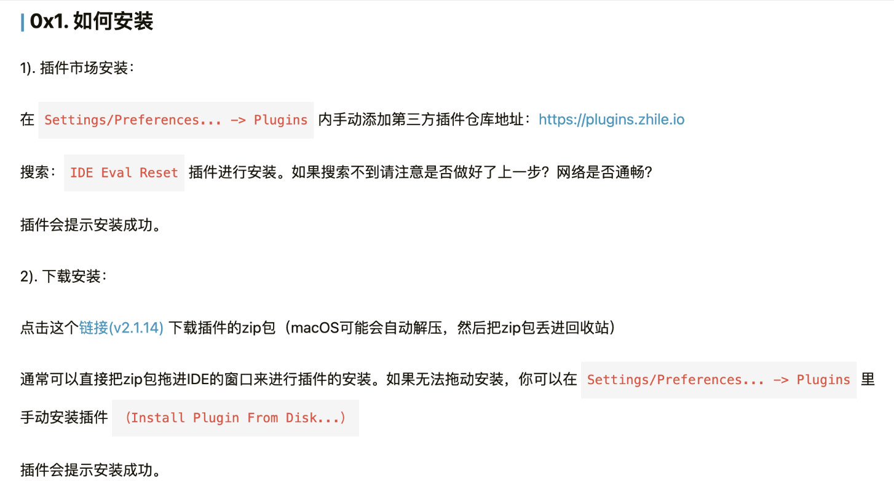
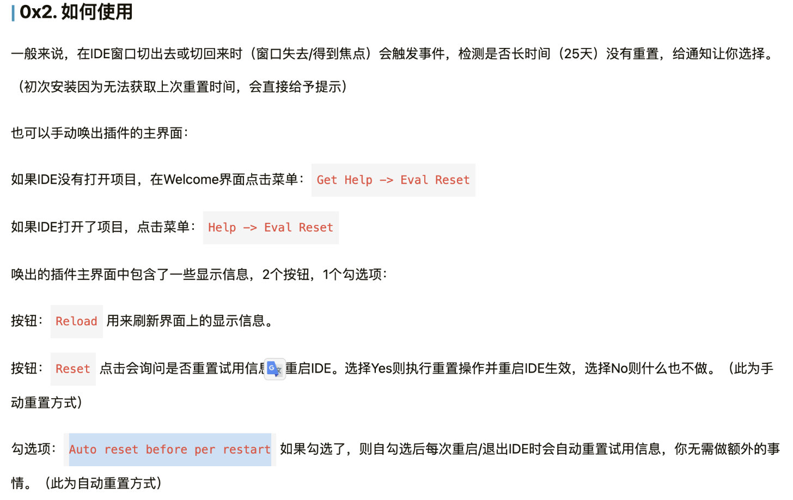
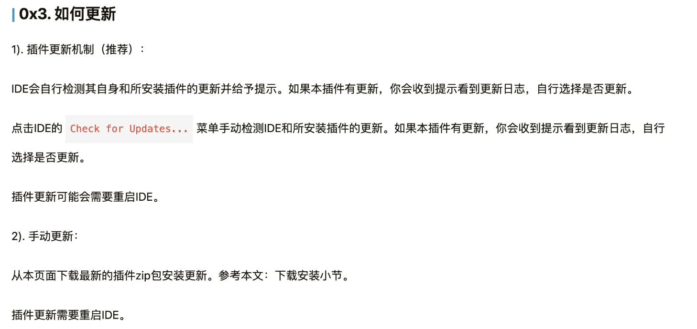

###  版本

版本：2021.1

###  步骤

1. 官方下载指定版本，并试用30天

2. 获取插件资源：

   >链接: https://pan.baidu.com/s/1srLnRp-sj1sBxXLqNJwNYQ?pwd=2w6k 
   >
   >提取码: 2w6k 

3. 手动安装插件（Install Plugin From Disk...）
4. Get Help -> Eval Reset
5. Auto reset before per restart

###  细节

- 如何安装

- 如何使用

- 如何更新

