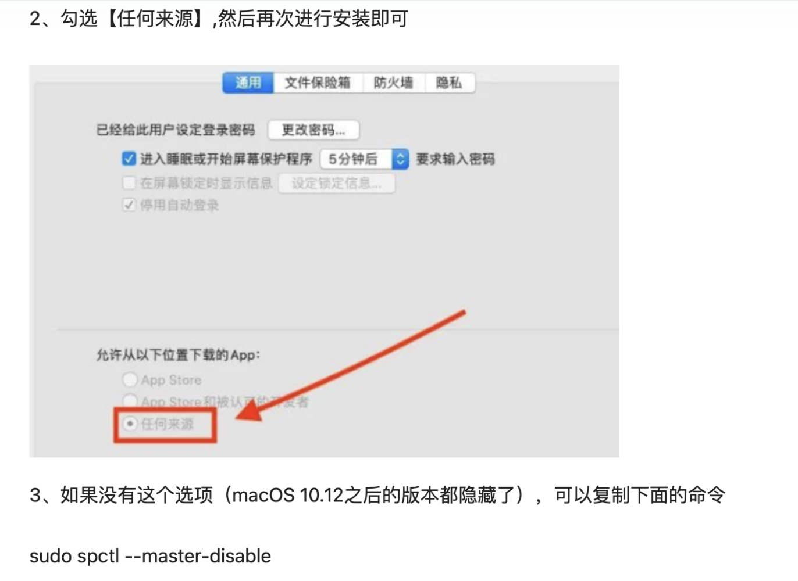
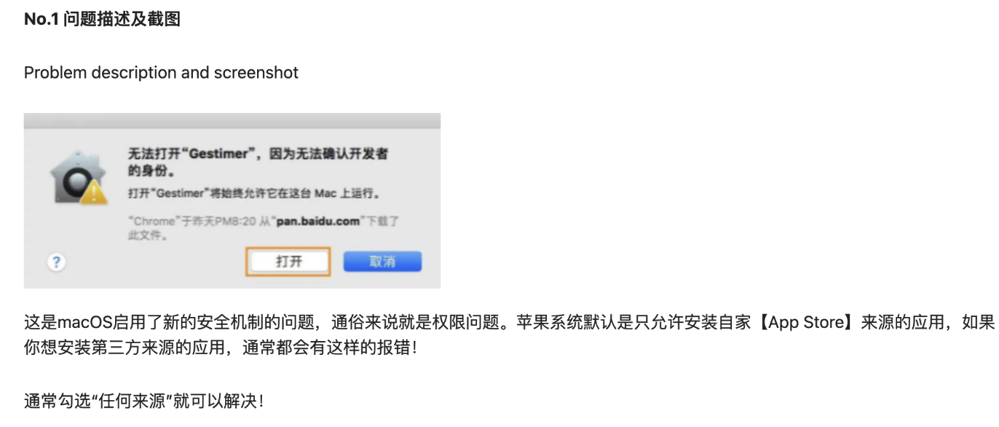

#  常用操作

##  快捷键

- 关闭程序快捷键：command + q

- 强制退出：option + command + esc

- emoj词典：control + command + space

- 网页放大缩小：command +/-

- 文件剪切： command + c 拷贝文件 ——》 目标文件夹 option + command + v

- 文字剪切： command + x & command + v

- 三指拖动： 系统设置 —》 辅助功能 —》 指针控制 —》 触控板选项 —》 开启触控板拖移，选择三指拖移

- 触控板四指上滑： 预览所有桌面程序，四指下滑恢复窗口

- 复制： command + d 文件旁边直接生成副本。（command + c  & command +v）

- 拷贝： command + c
- 聚焦搜索：command + space
- 屏幕锁屏：command + control + q

- Mac 自带截屏：

  1. shift + command + 3  全屏截图

  2. shift + command + 4  所选区域截图  如加按空格，可以截屏指定窗口

  3. Shift + command + 5  弹出功能框，包含上述三个快捷键按钮 外加屏幕录制

##  启动台排列

```shell
defaults write com.apple.dock springboard-rows -int 7			// 每行7个
defaults write com.apple.dock springboard-columns -int 9。       // 每行9个
defaults write com.apple.dock ResetLaunchPad -bool true;killall Dock。 重置并重启
defaults write com.apple.dock springboard-rows Default defaults write com.apple.dock springboard-columns Default killall Dock 			// 恢复默认排列方式
```

##  最近程序数

```shell
defaults write com.apple.dock show-recents -bool true;
defaults write com.apple.dock show-recent-count -int 10;
killall Dock
```

##  安装限制

```shell
sudo spctl —master-disable  // 展示设置安全选项中的【任何来源】
```



##  下载完打不开



1. 终端输入

```shell
sudo xattr -r -d com.apple.quarantine + 空格 + 在应用程序中找到App拖入终端里面即可
```

2. 放开苹果安全性校验


